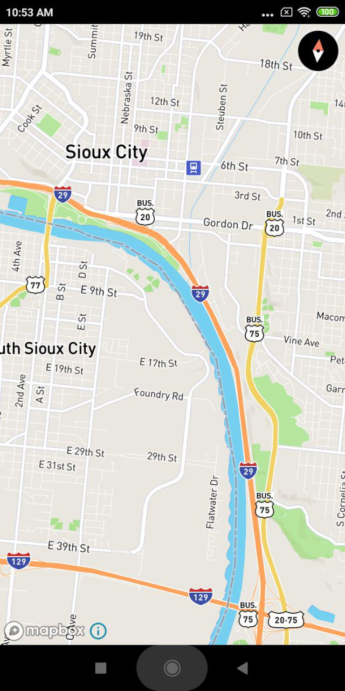
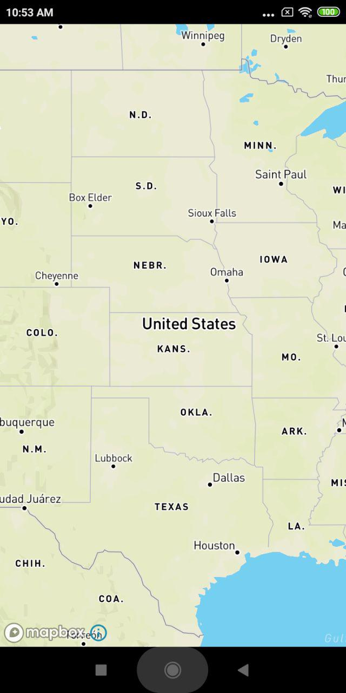
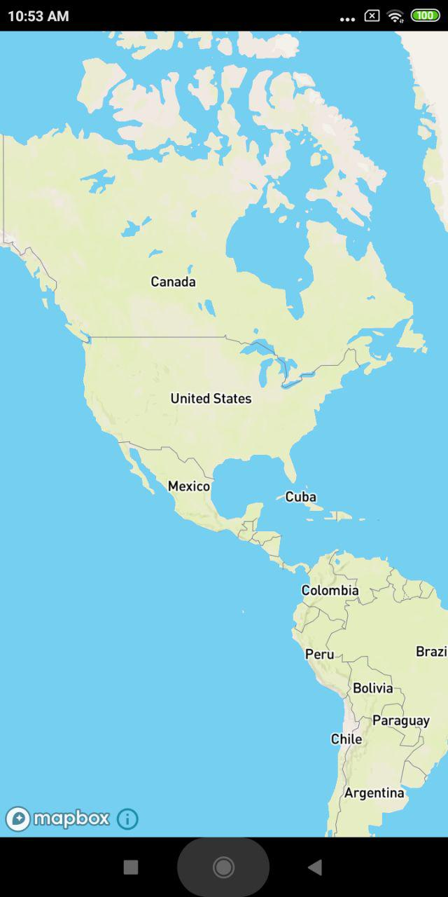
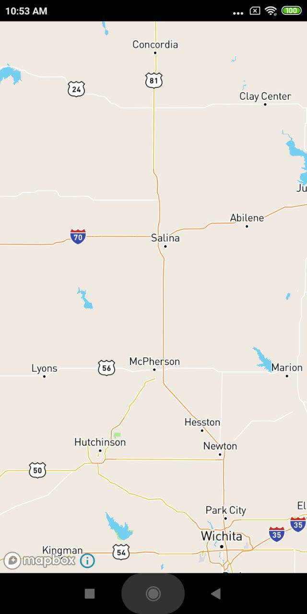
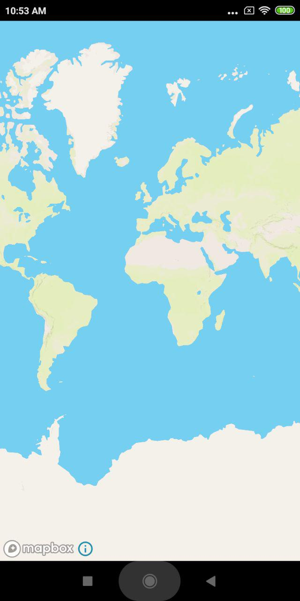

# MapBox

# Map Box Sample Android

Example Map Android application based on **MapBox**.

- minSdkVersion 14
- targetSdkVersion 29

```
implementation 'com.mapbox.mapboxsdk:mapbox-android-sdk:8.5.0'
```











### Create API Key

Go to panel: https://www.mapbox.com/

### Want for sdk9?

This loaded, But have a bug, So wont works! (I dont know)

```
implementation "com.mapbox.mapboxsdk:mapbox-android-sdk:4.0.1"
```

### Other Libs / Temp Section

Maybe this help you to find your version easily.

```
// Required for all projects
implementation 'com.github.car2go.AnyMaps:anymaps-base:6.0.1'
// [Optional] Google Maps
implementation 'com.github.car2go.AnyMaps:anymaps-google:x.y.z'
implementation 'com.google.android.gms:play-services-maps:x.y.z'
// [Optional] OpenStreet maps
implementation 'com.github.car2go.AnyMaps:anymaps-osm:6.0.1'
// [Optional] Baidu maps
implementation 'com.github.car2go.AnyMaps:anymaps-baidu:x.y.z'

// Google
implementation 'com.android.support:support-v4:27.1.1'
implementation 'com.android.support:design:28.0.0'
implementation 'com.android.support:appcompat-v7:19.1.+'
implementation 'com.android.support:appcompat-v4:23.0.0'
implementation 'com.android.support:support-v4:28.0.0'
implementation 'com.android.support:design:23.1.0'
implementation 'com.android.support.constraint:constraint-layout:1.1.3'
api "androidx.legacy:legacy-support-v4:1.0.0"

// Mapbox SDK dependency
implementation 'com.mapbox.mapboxsdk:mapbox-android-sdk:2.0.0'
implementation ('com.mapbox.mapboxsdk:mapbox-android-navigation:0.6.2') {
    exclude group: 'android.arch.core'
}
implementation ('com.mapbox.mapboxsdk:mapbox-android-sdk:3.2.0@aar'){
    transitive=true
}
implementation 'com.mapbox.mapboxsdk:mapbox-android-sdk:2.0.0'
```

---------

# Max Base

My nickname is Max, Programming language developer, Full-stack programmer. I love computer scientists, researchers, and compilers.

## Asrez Team

A team includes some programmer, developer, designer, researcher(s) especially Max Base.

[Asrez Team](https://www.asrez.com/)
